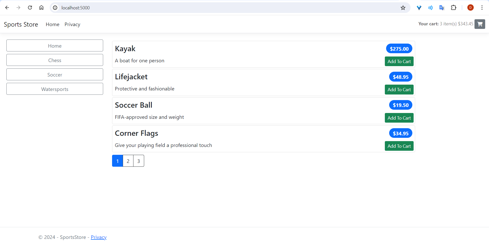
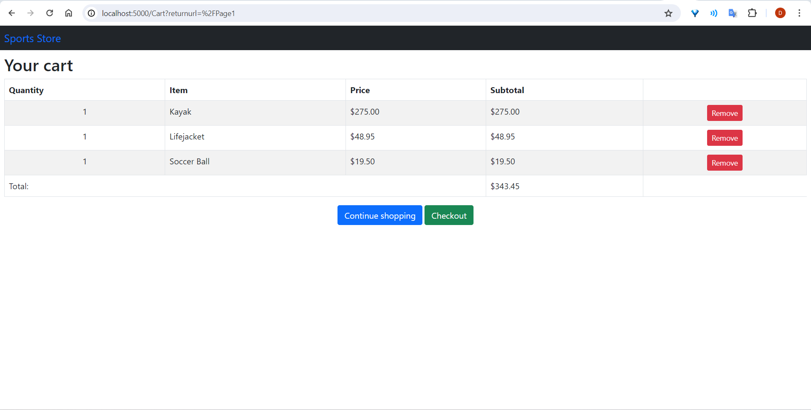

# SportsStore
This is a simple project using ASP.NET Core and EntityFramework Core.


## Screenshots




## Getting Started
These instructions will get you a copy of the project up and running on your local machine for development and testing purposes. See deployment for notes on how to deploy the project on a live system.

### Prerequisites
- Visual Studio 2022 or higher 
- .NET 7.x SDK  
- SQL Server / Npgsql.EntityFrameworkCore.PostgreSQL 2.1.1.1 (https://www.nuget.org/packages/Npgsql.EntityFrameworkCore.PostgreSQL/)

### How To Run
* Update ```global.json``` to match an installed SDK
* Open solution in Visual Studio and press Start (Ctrl+F5)
* Alternatively, use the ```dotnet run``` command from the terminal
